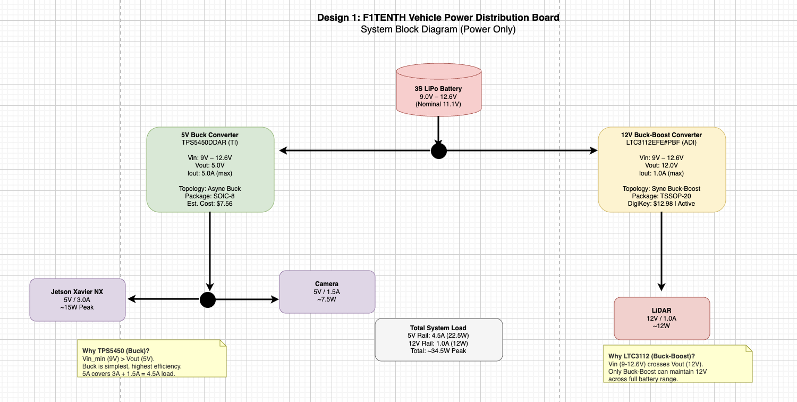
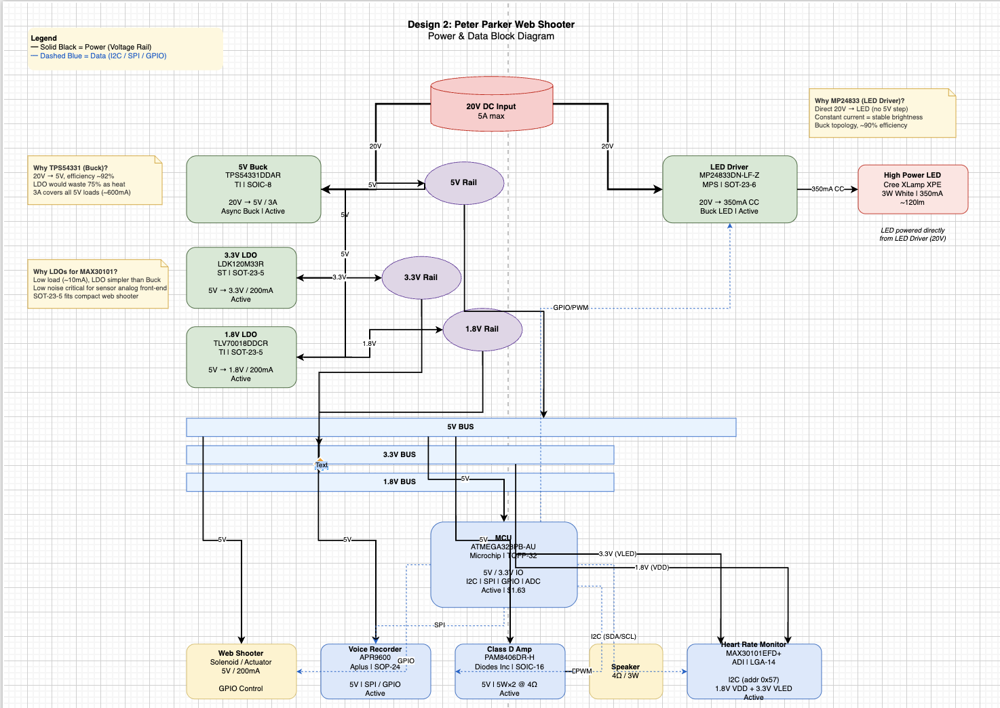

# WS1 - Power Management & Bootloading

## Design 1: F1TENTH Vehicle Power Distribution Board

### System Overview

The F1TENTH autonomous vehicle requires a power distribution board that takes a 3S LiPo battery input and provides regulated power to three peripherals:

- **Jetson Xavier NX**: 5V / 3.0A (~15W peak)
- **Camera**: 5V / 1.5A (~7.5W)
- **LiDAR**: 12V / 1.0A (~12W)

**Input Voltage Analysis:**
- 3S LiPo battery: 3 cells in series
- Per-cell voltage range: 3.0V (depleted) to 4.2V (fully charged)
- **Total input voltage range: 9.0V to 12.6V** (nominal 11.1V)

**Series vs. Parallel Tradeoffs:**
- Cells in **series** increase voltage while maintaining the same current capacity. This is ideal when the load requires higher voltage than a single cell can provide.
- Cells in **parallel** increase current capacity while maintaining the same voltage. This is ideal when the load requires more current than a single cell can safely deliver.
- For the F1TENTH vehicle, 3S configuration provides sufficient voltage for the 12V LiDAR while the C-rating ensures adequate current delivery.

### Block Diagram

The block diagram shows a single 3S LiPo battery feeding two independent DC/DC converter paths:
1. A **Buck converter** stepping 9-12.6V down to 5V for the Jetson and Camera
2. A **Buck-Boost converter** maintaining 12V for the LiDAR across the full battery voltage range

### Component Selection & Justification

#### 1. 5V Buck Converter — TPS5450DDAR (Texas Instruments)

| Parameter | Specification | Design Requirement | Satisfied? |
|-----------|--------------|-------------------|------------|
| Input Voltage | 5.5V - 36V | 9.0V - 12.6V | Yes |
| Output Current | 5A (max) | 4.5A (3A + 1.5A) | Yes (11% margin) |
| Output Voltage | Adjustable (1.22V - 31V) | 5.0V | Yes |
| Topology | Async Buck | Vin_min > Vout | Yes |
| Efficiency | ~90% at 12V→5V | High efficiency required | Yes |
| Package | SOIC-8 | Hand-solderable | Yes |

**Selection Rationale:**
- **Current headroom:** The combined 5V load is 4.5A (Jetson 3A + Camera 1.5A). The TPS5450 provides 5A, leaving an 11% safety margin. This prevents thermal stress and ensures reliable operation under peak loads.
- **Buck topology appropriateness:** Since Vin_min (9V) > Vout (5V), a Buck converter is the simplest and most efficient choice. Buck converters achieve ~90% efficiency when stepping 12V down to 5V, versus ~40% for an LDO which would dissipate (12.6V - 5V) × 4.5A = 34.2W as heat.
- **Wide input range:** The 5.5V-36V range comfortably covers the 3S LiPo range and provides tolerance for voltage transients.
- **Cost-effectiveness:** At approximately $7.56/unit, this is a cost-effective solution for a 5A regulator.

#### 2. 12V Buck-Boost Converter — LTC3112EFE#PBF (Analog Devices)

| Parameter | Specification | Design Requirement | Satisfied? |
|-----------|--------------|-------------------|------------|
| Input Voltage | 2.5V - 15V | 9.0V - 12.6V | Yes |
| Output Voltage | 0.1V - 15V (adjustable) | 12.0V | Yes |
| Output Current | 2.5A switch current | 1.0A @ 12V | Yes |
| Topology | Sync Buck-Boost | Vin crosses Vout | Yes |
| Efficiency | ~90% | High efficiency required | Yes |
| Package | TSSOP-20 | Hand-solderable | Yes |

**Selection Rationale:**
- **Buck-Boost necessity:** The 3S LiPo voltage range (9V - 12.6V) **crosses** the target 12V output. When the battery is fully charged (12.6V), a Buck topology is needed. When depleted (9V), a Boost topology is needed. Only a Buck-Boost converter can maintain a stable 12V output across the entire battery discharge cycle.
- **Synchronous topology:** The LTC3112 uses four internal MOSFETs in a synchronous Buck-Boost configuration, eliminating the need for external diodes and achieving higher efficiency (~90%) compared to asynchronous designs.
- **Current margin:** With 2.5A switch current limit and a 1A load, there is ample headroom. Even accounting for efficiency losses during Boost operation (9V → 12V), the converter operates well within its safe operating area.
- **Single inductor:** Unlike SEPIC or Ćuk converters that require two inductors, the LTC3112 uses only one inductor, reducing BOM cost and PCB area.

#### 3. Design 1 Passive Components

| Component | Value | Purpose | Package |
|-----------|-------|---------|---------|
| Inductor (Buck) | 4.7µH, 6A+ saturation | TPS5450 energy storage | SMD shielded |
| Inductor (Buck-Boost) | 10µH, 3A+ saturation | LTC3112 energy storage | SMD shielded |
| Schottky Diode | 3A, 40V | TPS5450 freewheeling | SMA |
| Input Capacitor | 22µF, 25V, X5R | Input ripple suppression | 0805 |
| Output Capacitor (5V) | 22µF, 16V, X5R | Output voltage stability | 0805 |
| Output Capacitor (12V) | 22µF, 25V, X5R | Output voltage stability | 0805 |
| Feedback Resistors | 1%, 0603 | Output voltage programming | 0603 |

---

## Design 2: Peter Parker Web Shooter

### System Overview

Peter Parker's upgraded web shooter requires power and data management for multiple subsystems:

- **Input:** 20V DC, 5A max
- **Web Shooter (Solenoid):** 5V / 200mA
- **Speaker + Class D Amp:** 5V / up to 5W×2
- **Heart Rate Monitor:** 1.8V (VDD) + 3.3V (VLED)
- **High Power LED:** 350mA constant current
- **Voice Recorder:** 5V
- **MCU:** ATMEGA328PB (5V/3.3V IO)

### Block Diagram

The block diagram shows a **two-branch power architecture:**
1. **Main branch:** 20V → 5V Buck → 5V Rail → distributes to MCU, Web Shooter, Voice Recorder, and Audio Amp. Two LDOs (3.3V and 1.8V) derive from the 5V rail for the Heart Rate Monitor.
2. **LED branch:** 20V → LED Buck Driver → directly drives the High Power LED at constant current, bypassing the 5V rail to avoid loading the main converter.

**Data lines (dashed blue) connect:**
- MCU ↔ Web Shooter (GPIO)
- MCU ↔ Voice Recorder (SPI)
- MCU ↔ Class D Amp (PWM)
- MCU ↔ Heart Rate Monitor (I2C)
- MCU ↔ LED Driver (GPIO/PWM for dimming)

### Component Selection & Justification

#### 1. Main 5V Buck Converter — TPS54331DDAR (Texas Instruments)

| Parameter | Specification | Design Requirement | Satisfied? |
|-----------|--------------|-------------------|------------|
| Input Voltage | 3.5V - 28V | 20V | Yes |
| Output Current | 3A (max) | ~600mA total 5V load | Yes (5× margin) |
| Output Voltage | Adjustable (0.8V - 22V) | 5.0V | Yes |
| Topology | Async Buck | Vin >> Vout | Yes |
| Efficiency | ~92% at 20V→5V | High efficiency required | Yes |
| Package | SOIC-8 | Hand-solderable | Yes |

**Selection Rationale:**
- **Extreme efficiency advantage:** At 20V → 5V, a Buck converter achieves ~92% efficiency. An LDO would be limited to 5V/20V = 25% efficiency, dissipating (20V - 5V) × 0.6A = **9W** as heat — requiring a heatsink and wasting significant power.
- **Load calculation:** Total 5V load ≈ Web Shooter (200mA) + ATMEGA328PB (50mA) + PAM8406 (100mA) + APR9600 (50mA) + MAX30101 VLED (50mA) ≈ **450mA**. The TPS54331's 3A rating provides massive headroom for future expansion.
- **High switching frequency:** 570kHz operation allows use of standard-size inductors and ceramic capacitors, keeping the design compact for Peter's web shooter.

#### 2. 3.3V LDO — LDK120M33R (STMicroelectronics)

| Parameter | Specification | Design Requirement | Satisfied? |
|-----------|--------------|-------------------|------------|
| Input Voltage | 1.5V - 5.5V | 5.0V rail | Yes |
| Output Voltage | 3.3V (fixed) | MAX30101 VLED | Yes |
| Output Current | 200mA | ~50mA (MAX30101 VLED) | Yes (4× margin) |
| Dropout Voltage | 250mV @ 200mA | 5V - 3.3V = 1.7V headroom | Yes |
| Package | SOT-23-5 | Ultra-compact | Yes |

**Selection Rationale:**
- **LDO appropriate for light loads:** The MAX30101's VLED pin draws only ~10-50mA. At this current, an LDO's inefficiency is negligible: (5V - 3.3V) × 0.05A = 85mW dissipation — no heatsink required.
- **Low noise critical:** The MAX30101 contains sensitive analog circuitry (photodiode, ADC). LDOs provide cleaner output (lower ripple) than switching converters, improving sensor accuracy.
- **Compact size:** SOT-23-5 is one of the smallest hand-solderable packages, essential for fitting everything into a wrist-worn web shooter.

#### 3. 1.8V LDO — TLV70018DDCR (Texas Instruments)

| Parameter | Specification | Design Requirement | Satisfied? |
|-----------|--------------|-------------------|------------|
| Input Voltage | 1.7V - 5.5V | 5.0V rail | Yes |
| Output Voltage | 1.8V (fixed) | MAX30101 VDD | Yes |
| Output Current | 200mA | ~1mA (MAX30101 VDD) | Yes (200× margin) |
| Dropout Voltage | 175mV @ 200mA | 5V - 1.8V = 3.2V headroom | Yes |
| Package | SOT-23-5 | Ultra-compact | Yes |

**Selection Rationale:**
- **Dual-rail sensor requirement:** The MAX30101 requires two separate supplies: 1.8V for digital logic (VDD) and 3.3V for LED drivers (VLED). The TLV70018 provides the ultra-low-noise 1.8V rail needed for the sensor's internal ADC and digital core.
- **Extremely low load:** The MAX30101's digital core draws only ~600µA in measurement mode. Even with the LDO's quiescent current, total power waste is under 5mW — completely negligible.

#### 4. LED Driver — MP24833DN-LF-Z (Monolithic Power Systems)

| Parameter | Specification | Design Requirement | Satisfied? |
|-----------|--------------|-------------------|------------|
| Input Voltage | 6V - 55V | 20V | Yes |
| Output Current | Adjustable, up to 1A | 350mA | Yes |
| Topology | Buck LED Driver | High-power LED drive | Yes |
| Dimming | PWM / Analog | Brightness control | Yes |
| Package | SOT-23-6 | Compact | Yes |

**Selection Rationale:**
- **Direct 20V drive:** The MP24833 accepts 6-55V input, so it can drive the LED **directly from the 20V source** without going through the 5V Buck. This offloads the main converter and improves overall system efficiency.
- **Constant current essential:** High-power LEDs must be driven with constant current, not constant voltage. A resistor-based current limiter from 20V would dissipate (20V - 3.2V) × 0.35A = 5.88W — the resistor would overheat and burn. The MP24833's Buck topology achieves ~90% efficiency.
- **PWM dimming:** The MCU can send a PWM signal to the MP24833's DIM pin, allowing Peter to adjust LED brightness from the web shooter interface.

#### 5. Audio Amplifier — PAM8406DR-H (Diodes Incorporated)

| Parameter | Specification | Design Requirement | Satisfied? |
|-----------|--------------|-------------------|------------|
| Supply Voltage | 2.5V - 5.5V | 5.0V rail | Yes |
| Output Power | 5W × 2 @ 4Ω | Loud superhero music | Yes |
| Topology | Class D (filterless) | High efficiency | Yes |
| Efficiency | >90% | Battery life | Yes |
| Package | SOIC-16 | Hand-solderable | Yes |

**Selection Rationale:**
- **Class D efficiency:** Class D amplifiers switch at high frequency rather than operating in linear mode, achieving >90% efficiency. A Class AB amplifier would only achieve ~55% efficiency, requiring significantly more current from the 5V rail.
- **Filterless output:** The PAM8406 uses a low-EMI modulation scheme that eliminates the need for external LC output filters. The speaker connects directly to the chip — minimal BOM.
- **Stereo output:** 5W per channel provides loud, clear audio for Peter's "superhero entrance music." The original PAM8403 only provides 3W×2; the PAM8406 is the recommended upgrade.

#### 6. Heart Rate Monitor — MAX30101EFD+ (Analog Devices / Maxim)

| Parameter | Specification | Design Requirement | Satisfied? |
|-----------|--------------|-------------------|------------|
| Function | SpO2 + Heart Rate | Fitness tracking | Yes |
| Interface | I2C (addr 0x57) | ATMEGA328PB compatible | Yes |
| VDD | 1.8V | Provided by TLV70018 | Yes |
| VLED | 3.3V | Provided by LDK120 | Yes |
| Package | LGA-14 | Compact (2.8×2.4mm) | Yes |

**Selection Rationale:**
- **All-in-one optical solution:** The MAX30101 integrates red LED (660nm), IR LED (940nm), photodiode, 18-bit ADC, and ambient light rejection — no external optical components needed. Peter just needs to press his finger against the sensor.
- **I2C simplicity:** Only 2 wires (SDA/SCL) plus an optional interrupt pin connect to the ATMEGA328PB. Maxim provides Arduino libraries for heart rate and SpO2 calculation.
- **Low power:** Active measurement mode draws only ~600µA from the 1.8V rail, ideal for a battery-powered wearable.

#### 7. Voice Recorder — APR9600 (Aplus Integrated Circuits)

| Parameter | Specification | Design Requirement | Satisfied? |
|-----------|--------------|-------------------|------------|
| Supply Voltage | 3V - 5V | 5.0V rail | Yes |
| Recording Time | 8-60 seconds (configurable) | Diary entries | Yes |
| Interface | Keypad + GPIO trigger | MCU control | Yes |
| Speaker Drive | Built-in 8Ω driver | No external amp needed | Yes |
| Storage | Internal non-volatile Flash | Retains after power-off | Yes |
| Package | SOP-24 / SOP-28 | Hand-solderable | Yes |

**Selection Rationale:**
- **Single-chip solution:** The APR9600 contains microphone preamp, ADC, Flash storage, and speaker driver in one IC. Only a microphone, speaker, and mode-setting resistor are needed externally.
- **Non-volatile storage:** Recordings persist after power loss (Flash memory), unlike RAM-based solutions. Peter can record diary entries and they'll survive battery swaps.
- **MCU controllable:** The ATMEGA328PB can trigger REC and PLAY via GPIO pins, enabling automated voice logging.

#### 8. MCU — ATMEGA328PB-AU (Microchip Technology)

| Parameter | Specification | Design Requirement | Satisfied? |
|-----------|--------------|-------------------|------------|
| Voltage | 1.8V - 5.5V | 5.0V / 3.3V IO | Yes |
| Flash | 32KB | Program storage | Yes |
| I2C | 1 master | MAX30101 | Yes |
| SPI | 1 master | APR9600 | Yes |
| GPIO | 23 usable | LED, Web Shooter, Amp | Yes |
| ADC | 8-channel, 10-bit | Voltage monitoring | Yes |
| Package | TQFP-32 | Standard, hand-solderable | Yes |

**Selection Rationale:**
- **Course requirement:** The ATMEGA328PB is specified as the required MCU for this design.
- **Arduino ecosystem:** Full Arduino IDE and library support (SparkFun/Adafruit libraries for MAX30101, existing APR9600 code examples).
- **Sufficient peripherals:** One I2C bus handles the heart rate monitor; one SPI bus can control the voice recorder; abundant GPIOs manage the LED driver, web shooter solenoid, and audio amp.

### Design 2 Passive Components

| Component | Value | Purpose | Package |
|-----------|-------|---------|---------|
| Inductor (Main Buck) | 22µH, 3A+ saturation | TPS54331 energy storage | SMD shielded |
| Inductor (LED Driver) | 4.7µH, 1A+ saturation | MP24833 energy storage | SMD shielded |
| Input Capacitor (Buck) | 22µF, 25V, X5R | Input ripple filtering | 0805 |
| Output Capacitor (Buck) | 22µF, 16V, X5R | Output voltage stability | 0805 |
| Output Capacitor (LDO 3.3V) | 10µF, 10V, X5R | LDO stability | 0805 |
| Output Capacitor (LDO 1.8V) | 10µF, 10V, X5R | LDO stability | 0805 |
| Current Sense Resistor (LED) | 0.3Ω, 1% | MP24833 current programming | 0805 |
| Feedback Resistors | 1%, 0603 | Voltage programming | 0603 |

---

## Bill of Materials (BOM)

### Design 1 BOM

| Component | Type | Qty | Cost (USD) | DigiKey Part ID | Manufacturer Part Number | Package | Notes |
|-----------|------|-----|-----------|-----------------|-------------------------|---------|-------|
| 5V Buck Converter | SMD | 1 | 7.56 | 296-26997-2-ND | TPS5450DDAR | SOIC-8 | Async Buck, 5A |
| 12V Buck-Boost Converter | SMD | 1 | 12.98 | 505-1973-1-ND | LTC3112EFE#PBF | TSSOP-20 | Sync Buck-Boost, 2.5A |
| Schottky Diode | SMD | 1 | 0.30 | B340A-FDICT-ND | B340A-13-F | SMA | 3A, 40V freewheeling |
| Buck Inductor | SMD | 1 | 1.50 | 732-4975-1-ND | 74437349047 | 6.6×6.6mm | 4.7µH, 6.8A, shielded |
| Buck-Boost Inductor | SMD | 1 | 1.50 | 732-4976-1-ND | 74437349100 | 6.6×6.6mm | 10µH, 4.2A, shielded |
| Input Capacitor | SMD | 2 | 0.20 | 490-10611-1-ND | GRM21BR61E226KE44L | 0805 | 22µF, 25V, X5R |
| Output Capacitor (5V) | SMD | 2 | 0.20 | 490-3894-1-ND | GRM21BR61C226KE44L | 0805 | 22µF, 16V, X5R |
| Output Capacitor (12V) | SMD | 2 | 0.20 | 490-10611-1-ND | GRM21BR61E226KE44L | 0805 | 22µF, 25V, X5R |
| Feedback Resistor Set | SMD | 4 | 0.05 | P1.00KJCT-ND | ERJ-3EKF1001V | 0603 | 1kΩ, 1%, 1/10W |

**Design 1 Total Estimated Cost: ~$25.91**

### Design 2 BOM

| Component | Type | Qty | Cost (USD) | DigiKey Part ID | Manufacturer Part Number | Package | Notes |
|-----------|------|-----|-----------|-----------------|-------------------------|---------|-------|
| 5V Buck Converter | SMD | 1 | 2.01 | 296-37873-2-ND | TPS54331DDAR | SOIC-8 | Async Buck, 3A |
| 3.3V LDO | SMD | 1 | 0.56 | 497-13500-1-ND | LDK120M33R | SOT-23-5 | 200mA, low noise |
| 1.8V LDO | SMD | 1 | 0.24 | 296-32410-2-ND | TLV70018DDCR | SOT-23-5 | 200mA, low noise |
| LED Driver | SMD | 1 | 0.85 | 1588-MP24833DN-LF-Z | MP24833DN-LF-Z | SOT-23-6 | Buck LED, 1A |
| Class D Audio Amp | SMD | 1 | 0.80 | PAM8406DRDICT-ND | PAM8406DR-H | SOIC-16 | 5W×2, filterless |
| Heart Rate Sensor | SMD | 1 | 13.51 | MAX30101EFD+T | MAX30101EFD+ | LGA-14 | SpO2 + HR, I2C |
| Voice Recorder | SMD | 1 | 2.50 | APR9600 | APR9600 | SOP-24 | 8-60s, non-volatile |
| MCU | SMD | 1 | 1.63 | ATMEGA328PB-AU | ATMEGA328PB-AU | TQFP-32 | 32KB Flash, Arduino |
| High Power LED | SMD | 1 | 1.50 | XPEWHT-L1-R250-00E01 | XPEWHT-L1-R250-00E01 | 3.45×3.45mm | 3W white, 350mA |
| Buck Inductor | SMD | 1 | 0.50 | - | 22µH shielded | 5.2×5.2mm | TPS54331, 3A+ Isat |
| LED Inductor | SMD | 1 | 0.50 | - | 4.7µH shielded | 3.0×3.0mm | MP24833, 1A+ Isat |
| Input Capacitor | SMD | 2 | 0.20 | - | 22µF, 25V, X5R | 0805 | Buck input filtering |
| Output Capacitor | SMD | 2 | 0.20 | - | 22µF, 16V, X5R | 0805 | Buck output filtering |
| LDO Capacitor | SMD | 2 | 0.20 | - | 10µF, 10V, X5R | 0805 | LDO output stability |
| Current Sense Resistor | SMD | 1 | 0.05 | - | 0.3Ω, 1% | 0805 | LED current programming |
| Feedback Resistors | SMD | 4 | 0.05 | - | 1kΩ-10kΩ, 1% | 0603 | Voltage dividers |
| Electret Microphone | THT | 1 | 0.30 | - | - | 6×5mm | APR9600 audio input |
| Speaker | THT | 1 | 1.00 | - | 4Ω, 3W | 28mm | Audio output |

**Design 2 Total Estimated Cost: ~$27.30**

---

## Short Answer Questions (R5-R8)

### R5: What are two ways to step down the voltage of a DC power supply to a predetermined level?

1. **Linear Voltage Regulator (LDO):** Uses a pass transistor operating in its linear (ohmic) region to drop excess voltage. The output is regulated by continuously adjusting the transistor's resistance.
2. **Switching Regulator (Buck Converter):** Uses a high-frequency switching element (MOSFET), an inductor, and a diode/capacitor network to transfer energy in discrete packets. The duty cycle of the switch determines the output voltage.

### R6: List 3 advantages and 3 disadvantages for each method.

| Characteristic | Linear Regulator (LDO) | Switching Regulator (Buck) |
|----------------|----------------------|---------------------------|
| **Advantage 1** | Extremely low output noise and ripple — ideal for sensitive analog/RF circuits | Very high efficiency (80-95%) — minimal power wasted as heat |
| **Advantage 2** | Simple design — requires only input/output capacitors, no inductors | Can step down from very high input voltages to low outputs efficiently |
| **Advantage 3** | Fast transient response — output voltage recovers quickly from load changes | Can deliver high output currents (amperes) without excessive heating |
| **Disadvantage 1** | Very poor efficiency when Vin >> Vout — excess power dissipated as heat | Output contains switching ripple and EMI — requires filtering and careful PCB layout |
| **Disadvantage 2** | Can only step down (Vin must be > Vout + dropout voltage) | More complex design — requires inductor, diode, and more capacitors |
| **Disadvantage 3** | Large heatsink required for high current or large voltage differential | Slower transient response compared to LDOs due to inductor energy storage |

### R7: Describe a situation where you would prefer an LDO over a Buck converter.

**Scenario: Powering a precision analog sensor or ADC reference voltage.**

In Design 2, the MAX30101 heart rate sensor requires an extremely clean 1.8V supply for its internal ADC and photodiode front-end. Any switching noise from a Buck converter could couple into the analog signal path, corrupting the heart rate measurement. 

An LDO like the TLV70018 provides microvolt-level output noise and essentially zero ripple. The load current is tiny (~600µA), so the efficiency penalty is negligible: (5V - 1.8V) × 0.0006A = 1.9mW wasted. This is an insignificant tradeoff for the massive improvement in signal integrity.

Another example is powering a GPS receiver's RF front-end or a high-resolution ADC's voltage reference — any switching noise would directly degrade performance, making LDOs the only viable choice regardless of efficiency.

### R8: Describe a situation where you would prefer a Buck converter over an LDO.

**Scenario: Powering a high-current processor from a high-voltage battery.**

In Design 1, the Jetson Xavier NX requires 5V at 3A from a 3S LiPo battery (9-12.6V). If an LDO were used:
- At full battery (12.6V): Efficiency = 5V/12.6V = 39.7%
- Power dissipated = (12.6V - 5V) × 3A = **22.8W** — requiring a large heatsink and actively shortening battery life

A Buck converter (TPS5450) achieves ~90% efficiency:
- Power dissipated = 5V × 3A × (1 - 0.9) = **1.5W** — no heatsink needed
- Battery life extends by more than 2× compared to the LDO approach

Another example is the main 5V rail in Design 2: stepping 20V down to 5V at 500mA. An LDO would waste (20V - 5V) × 0.5A = 7.5W — enough to burn your finger. The TPS54331 Buck converter reduces this to under 0.5W.

---

## Sourcing Notes

All active ICs were verified against DigiKey inventory as of July 2026:
- **TPS5450DDAR:** Active, in stock
- **LTC3112EFE#PBF:** Active, in stock
- **TPS54331DDAR:** Active, in stock (~$2.01)
- **LDK120M33R:** Active, in stock (~$0.56)
- **TLV70018DDCR:** Active, in stock (~$0.24)
- **MP24833DN-LF-Z:** Active, in stock
- **PAM8406DR-H:** Active (replaces obsolete PAM8403)
- **MAX30101EFD+:** Active, in stock (~$13.51)
- **APR9600:** Active, in stock
- **ATMEGA328PB-AU:** Active, in stock (~$1.63)

Passive component DigiKey part numbers should be verified at time of order by searching for "22µH shielded SMD inductor," "22µF 25V X5R 0805 ceramic capacitor," and "1kΩ 1% 0603 thick film resistor" with "In Stock" filter applied.
